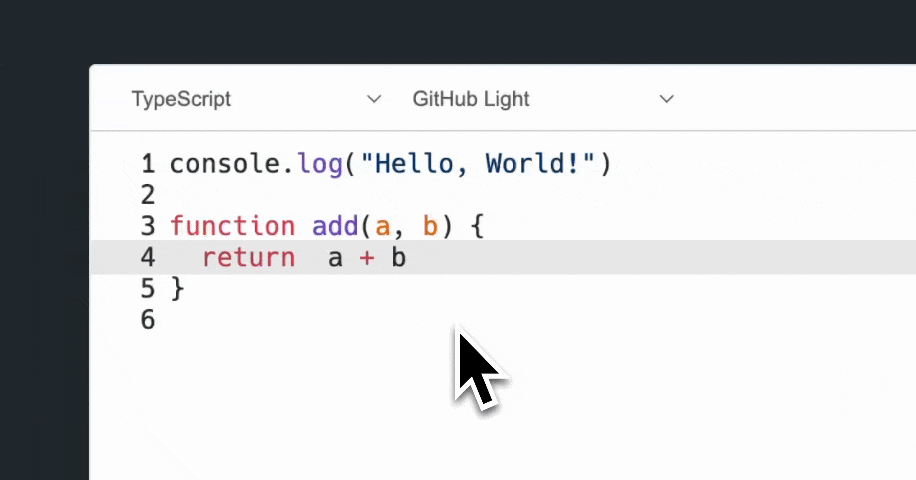
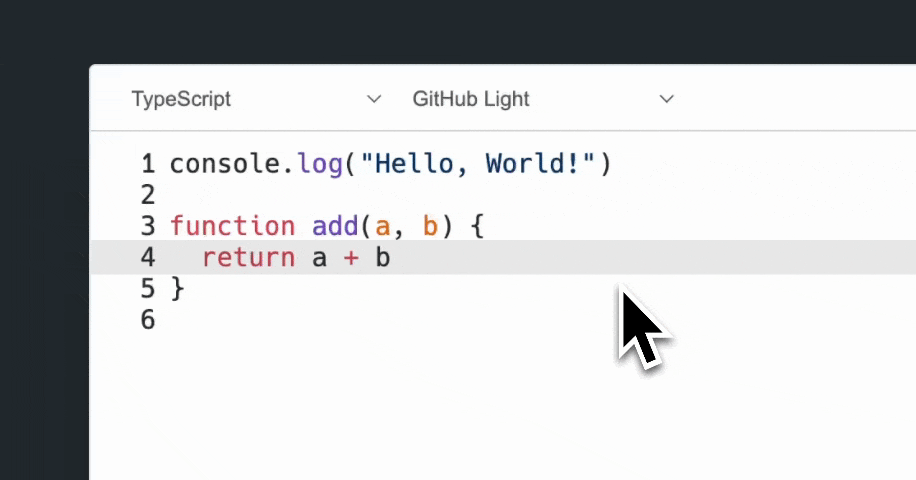
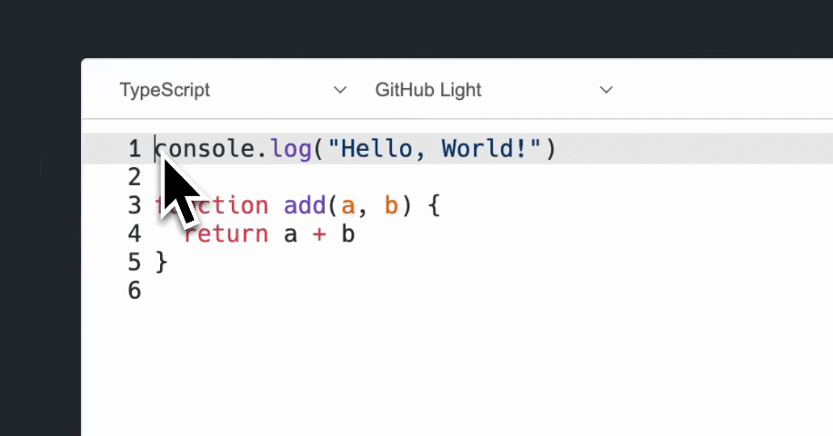
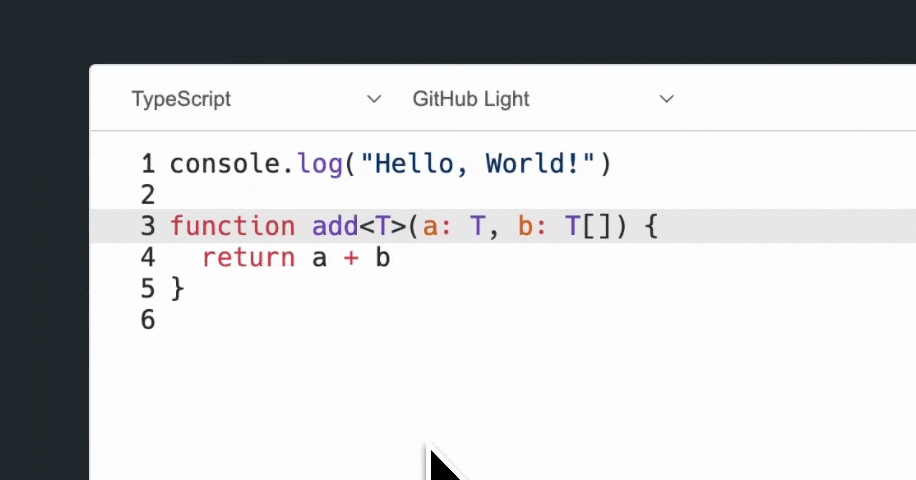

<p align="center">
  
</p>

## Description

A simple and lightweight code editor for the web.

｜en-US|[中文](./README.zh-CN.md)｜

## How to use

### CDN

For many users who want to experience the tool, CDN is a good choice. You can directly introduce this tool into your project and start using it.
You may have different usage habits. Here I provide you with several simple methods to introduce this tool. Below are some simple example links, you can click to view the corresponding files.

- [esm](./examples/static/esm.html)

  esm is a good choice, it allows you to use the import syntax to introduce this tool in the project. This is also the default export method of shiki, which is relatively convenient to use.
- [esm + plugins](./examples/static/esm+plugins.html)

  The pluggability of functions has always been a very important part of my code design philosophy. Here you can see how to introduce function expansion plugins.
- [umd](./examples/static/umd.html)

  If you don't want to use esm, then umd might be a good choice. It allows you to use the script tag to introduce this tool in the project.
  (But in fact, for shiki, it may not be a good example, I need some time to make it better reflect the advantages of umd)

### Node.js

For some users who want to use this tool in the compilation process, it may be a better choice to install dependencies through package management and then introduce this tool in the code.

- Install dependencies

```bash
npm install @shikitor/core
# If you are using yarn
yarn add @shikitor/core
```

- Introduce in the code

```javascript
import '@shikitor/core/index.css'

import { create } from '@shikitor/core'

const shikitor = create(document.getElementById('editor'), {
  value: 'console.log("Hello, Shikitor!")',
  language: 'javascript',
  theme: 'github-light'
})
```

## Features

### Keyboard shortcuts

#### `Tab`/`Shift + Tab`: Indent/Outdent

You can use `Tab` to indent the current line or selected lines, and use `Shift + Tab` to outdent.

- plugin: `@shikitor/core/plugins/code-styler`
- demo
  

#### Quick Jump

- plugin: `@shikitor/core/plugins/code-styler`
- `Cmd/Ctrl + ⬅️/➡️`: Jump to line start/end
  - demo
    

### Mouse interaction

#### Highlight the line of cursor position

- plugin: bundled
- demo
  

#### Highlight the closing bracket

- plugin: `@shikitor/core/plugins/bracket-matcher`
- demo
  

## Plugin system

Building...

## License

MIT
