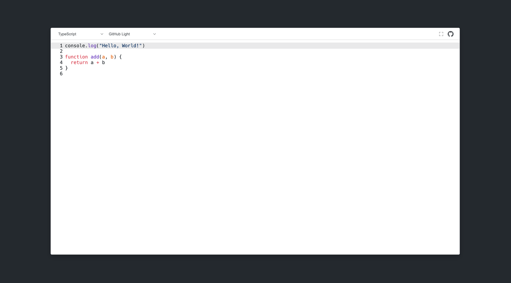

# Shikitor Core

The core of Shikitor, a simple and lightweight editor by [Shiki](https://shiki.matsu.io/).



## What is Shikitor?

A simple and lightweight editor based on [Shiki](https://shiki.matsu.io/), which extends your textarea elements, provides a series of configurable options and plugins, allows you to break free from the limitations of the browser's native API to achieve more functions, and even becomes a tool like Monaco.

## Installation

```bash
npm install @shikitor/core
# If you are using pnpm
pnpm install @shikitor/core
```
